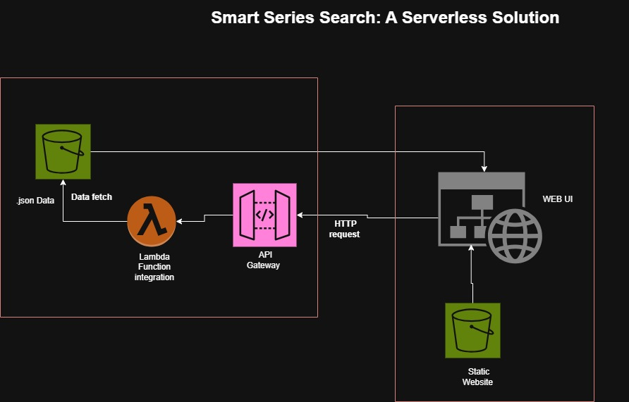

# Smart Series Search: A Serverless Solution

This project is a simple **TV Series Recommender** built using AWS Serverless technologies. The web-based application allows users to search for TV series based on parameters like:
- **Date Range** (e.g., 2000–2010)
- **Genre** (e.g., Drama)
- **Country of Production** (e.g., USA)
- **Number of Seasons** (e.g., 1, 2, or more)

The application retrieves results from a dataset stored in Amazon S3 and displays them on a lightweight web UI.

---

## Architecture Overview

The architecture is fully serverless and deployed using AWS CDK for automation. Below is a high-level view of the components:



1. **Static Website** hosted in an Amazon S3 bucket.
2. **Web UI** communicates with an **API Gateway** via HTTP requests.
3. **API Gateway** triggers a **Lambda function**, which fetches data from an S3 bucket containing the series dataset.
4. The Lambda function returns the results to the Web UI.

---

## Features
- **Serverless Architecture**: Fully managed components for scalability and cost-effectiveness.
- **Automated Deployment**: Simplified deployment using AWS CDK.
- **Dynamic Data Fetching**: Query a JSON-based dataset stored in S3.

---

## Technologies Used
- **AWS S3**: For static website hosting and data storage.
- **AWS Lambda**: For backend processing and integration.
- **Amazon API Gateway**: To handle HTTP API requests.
- **AWS CDK**: To define and deploy the infrastructure as code.

---

## Limitations
- **No Custom Domain**: The web UI is accessed via the S3 bucket's public URL.
- **No Database**: Search data and user activities are not stored. Future improvements could include integrating a database like DynamoDB.

## Future Improvements
- Add user authentication to secure the web UI and API.
- Store user searches and preferences using DynamoDB for more personalized recommendations.
- Enhance security by adding a custom domain and HTTPS with Amazon CloudFront.

## Deployment Instructions

To deploy this project:

1. **Clone the Repository**:
   ```bash
   git clone https://github.com/your-username/series-recommender-serverless-aws.git
   cd series-recommender-serverless-aws 
   ```

2. **Install Dependencies: Ensure you have AWS CDK and Node.js installed, then run**:
	```bash
	npm install -g aws-cdk
	npm install 
	```
	
3. **Bootstrap Your AWS Environment: If this is your first time using AWS CDK in the account/region:**
	```bash
	cdk bootstrap
	```
	
4. **Deploy the Stack:**
	```bash
	cdk deploy
	```
5. **Access the Application:**

	Web UI: http://tv-series-web-ui-<account>-<region>.s3-website.<region>.amazonaws.com
	API Endpoint: Copy the URL from the ApiDefaultUrl CloudFormation output (e.g., https://<api-id>.execute-api.<region>.amazonaws.com/dev).

